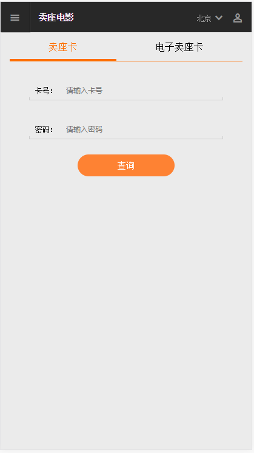

# 卖座vue版本

> 基于vue开发的卖座，实现基本功能

## Build Setup

``` bash
# install dependencies
npm install

# serve at localhost:3000
node proxy.js

# serve with hot reload at localhost:8080
npm run dev

# build for production with minification
npm run build

# build for production and view the bundle analyzer report
npm run build --report
```
## 部分截图如下
   
